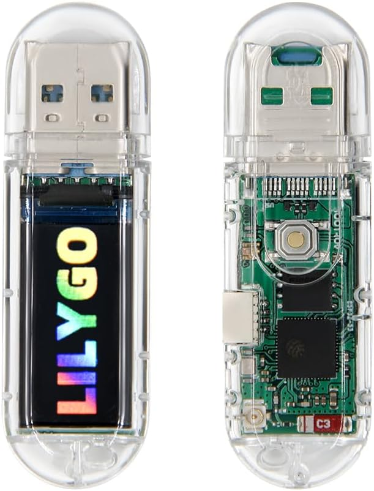
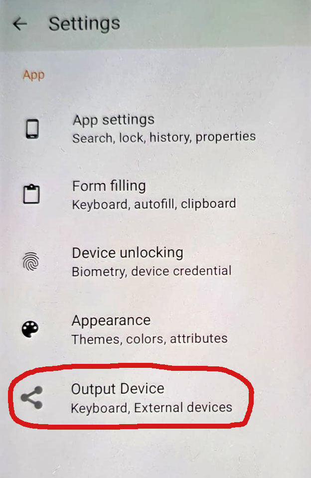
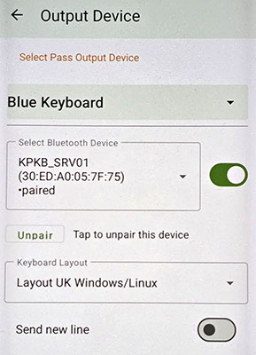
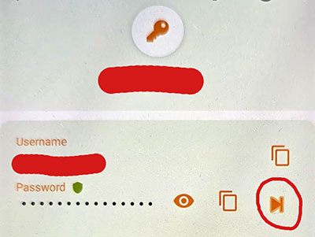

# KeePassDX with Bluetooth HID Dongle Support

This is a modified clone of the [KeePassDX Android app](https://github.com/Kunzisoft/KeePassDX).  
The purpose of this modification is to extend KeePassDX with the ability to send passwords directly to a remote machine **without having to type them in manually**.

## How It Works

I built a companion project: **USB HID keyboard emulator** running on an ESP32-S3 dongle.  
The dongle receives key events from KeePassDX over Bluetooth and injects them into the target machine as if typed from a physical keyboard.

## 🚀 What’s New (v1.2.1 Architecture)

### 🔐 1. MTLS Binary Protocol (Encrypted BLE Channel)

Communication with the dongle now uses a **custom miniature TLS-like protocol** to provide strong resistance to compromised client devices:

- ECDH P-256 key exchange  
- HKDF-SHA256 session key derivation  
- AES-CTR encryption  
- HMAC-SHA256 authentication  
- Strict binary framing (`B0`, `B1`, `B2`, `B3`, `C0`, `C1`, `D0`, `D1`, etc.)  
- Per-frame IVs and sequence numbers  

---

### 🔑 2. Secure Password-Based APPKEY Provisioning

First-time pairing now follows a secure challenge–response flow:

1. Dongle sends **A2** (salt, PBKDF2 iterations, challenge)  
2. App shows a password prompt  
3. User enters dongle password  
4. App computes PBKDF2-SHA256 → HMAC response (`A3`)  
5. Dongle returns encrypted **APPKEY** (`A1`)  
6. App decrypts and stores it securely via **AndroidKeyStore RSA**  

APPKEY provisioning happens only once limited to only one device/app.

---

### 🔁 3. Multi-Dongle Support (Multi-Key)

The app now fully supports multiple dongles:

- Individual APPKEY per device  
- Secure storage per device (RSA-encrypted)  
- Automatic identification of provisioned devices  
- Automatic strongest-signal selection for auto-connect  
- Smooth switching in settings  

---

> ⚠️ **Note:**  
> Make sure you use the latest version dongle firmware version (v1.2.1+) [blue_keyboard repository](https://github.com/larrylart/blue_keyboard/) 

## Hardware

The hardware used is the **LILYGO T-Dongle-S3 ESP32-S3 TTGO Development Board**, which features:

| Features | Image |
|---|---|
| <ul><li>0.96-inch ST7735 LCD display</li><li>TF card slot</li><li>USB HID capable ESP32-S3</li></ul><br><strong>You can find this board on:</strong><br>• Amazon ($30)<br>• AliExpress ($17) |  |


### Dongle Software

The dongle firmware and instructions can be found here:  
👉 [blue_keyboard repository](https://github.com/larrylart/blue_keyboard/)  

You’ll need to **flash the dongle** with that software before using this modified KeePassDX build.

---

## How to Install

You have two options:

1. **Install the unsigned APK**  
   - Download the release APK from the [Releases](https://github.com/larrylart/KeePassDX-kb/releases) section.  
   - Transfer it to your Android device.  
   - Enable “Install from Unknown Sources” in system settings.  
   - Manually install the APK to test the app.  

2. **Build from source**  
   - Clone this repository:  
     ```bash
     git clone https://github.com/larrylart/keepassdx-bluetooth.git
     cd keepassdx-bluetooth
     ```
   - Open the project in **Android Studio**.  
   - Compile a debug or release APK.  
   - Install it on your Android device.  

---

## Notes & Disclaimer

- This is a **few-days hack**, tested only briefly. Expect bugs and rough edges.
- the initial pairing should be done in Settings -> Output Settings, if the pairing popup shows before cancel it and do it in settings, reason for this is that app needs to request the provisioning password. Some work needs to be done here to disable pairing requests outside settings.  
- The multi keep behaviour sometime causes the dongle to crash/reboot and could take a few tries (restart KeePassDX) to detect and mark as primary. I have not managed to get to the bottom this yet, the dongle crash seems to be related to me trying to optimize a fast scan for provisioned keys and the app timing out in the middle of the handshake. I increased the timeout to 3.5s so it seems a bit more stable. If you encounter this problem you can always just go in settings and manually select which key should use. 
- My **Android development experience is limited**, so some implementation details may not be ideal.  
- Contributions and improvements are welcome!

---

## Modifications to KeePassDX

The following changes were made to KeePassDX master branch clone as of 20th of September 2025:

- Added a **Bluetooth interface singleton** to:
  - Scan for dongles  
  - Pair/unpair  
  - Send password data  

- Added a new **settings option: “Output Devices”**, where you can:  
  - Enable/disable dongle use (toggles the send-button next to password fields)  
  - Select and pair with a dongle (default name: `KPKB_SRV01`)
  - Select the dongle keyboard layout to match the host keyboard layout, so special character are "typed" accordingly.
  - Configure whether to **append a newline (`\n`)** when sending passwords  





---

## App Behaviour

- On startup:  
  - If “Output Device” is enabled and a BLE dongle is selected, KeePassDX will **auto-connect**.  
  - The dongle’s LED will turn **green** when connected.  
  - Connection persists while the app is open (to avoid reconnecting on every send).  

- On password send:  
  - Dongle LED blinks **red** every time it receives a valid string
  - Screen displays: `RECV: <counter>`  

- If it fails to connect/send:  
  - This may happen occasionally due to the BLE timeouts/exception that that are not currently handled.
  - Workaround: simply **restart KeePassDX**. If that does not work, unplug/plug the dongle and start KeePassDX again. If that still fails, reset the dongle to default (short button pressed followed immediately by a long press 3s+), and setup the dongle again and provision it in the app. Please do report issue that you encounter, especially if you can replicate them so I can fix the code.

---

## License

This project follows the same licensing as [KeePassDX](https://github.com/Kunzisoft/KeePassDX).  
Please check their repository for details.
