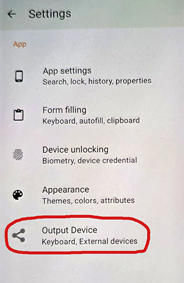

# KeePassDX with Bluetooth HID Dongle Support

This is a modified clone of the [KeePassDX Android app](https://github.com/Kunzisoft/KeePassDX).  
The purpose of this modification is to extend KeePassDX with the ability to send passwords directly to a remote machine **without having to type them in manually**.

## How It Works

I built a small companion project: a **USB HID keyboard emulator** running on an ESP32-S3 dongle.  
The dongle receives key events from KeePassDX over Bluetooth and injects them into the target machine as if typed from a physical keyboard.

### Hardware

The hardware used is the **LILYGO T-Dongle-S3 ESP32-S3 TTGO Development Board**, which features:

| Features | Image |
|---|---|
| <ul><li>0.96-inch ST7735 LCD display</li><li>TF card slot</li><li>USB HID capable ESP32-S3</li></ul><br><strong>You can find this board on:</strong><br>• Amazon ($30)<br>• AliExpress ($17) |  |


### Dongle Software

The dongle firmware and instructions can be found here:  
👉 [blue_keyboard repository](https://github.com/larrylart/blue_keyboard/)  

You’ll need to **flash the dongle** with that software before using this modified KeePassDX build.

---

## How to Install

You have two options:

1. **Install the unsigned APK**  
   - Download the release APK from the [Releases](./releases) section.  
   - Transfer it to your Android device.  
   - Enable “Install from Unknown Sources” in system settings.  
   - Manually install the APK to test the app.  

2. **Build from source**  
   - Clone this repository:  
     ```bash
     git clone https://github.com/larrylart/keepassdx-bluetooth.git
     cd keepassdx-bluetooth
     ```
   - Open the project in **Android Studio**.  
   - Compile a debug or release APK.  
   - Install it on your Android device.  

---

## Notes & Disclaimer

- This was a **one-day hack**, tested only briefly. Expect bugs and rough edges.  
- My **Android development experience is limited**, so some implementation details may not be ideal.  
- Contributions and improvements are welcome!

---

## Modifications to KeePassDX

The following changes were made to KeePassDX:

- Added a **Bluetooth interface singleton** to:
  - Scan for dongles  
  - Pair/unpair  
  - Send password data  

- Added a new **settings option: “Output Devices”**, where you can:  
  - Enable/disable dongle use (toggles the send-button next to password fields)  
  - Select and pair with a dongle (default name: `KPKB_SRV01`)  
  - Configure whether to **append a newline (`\n`)** when sending passwords  




---

## App Behaviour

- On startup:  
  - If “Output Device” is enabled and a BLE dongle is selected, KeePassDX will **auto-connect**.  
  - The dongle’s LED will turn **green** when connected.  
  - Connection persists while the app is open (to avoid reconnecting on every send).  

- On password send:  
  - Dongle LED blinks **red** for ~1 second  
  - Screen displays: `RECV: <counter>`  

- If it fails to connect/send:  
  - This may happen occasionally due to the quick implementation  
  - Workaround: simply **restart KeePassDX**  

---

## License

This project follows the same licensing as [KeePassDX](https://github.com/Kunzisoft/KeePassDX).  
Please check their repository for details.
